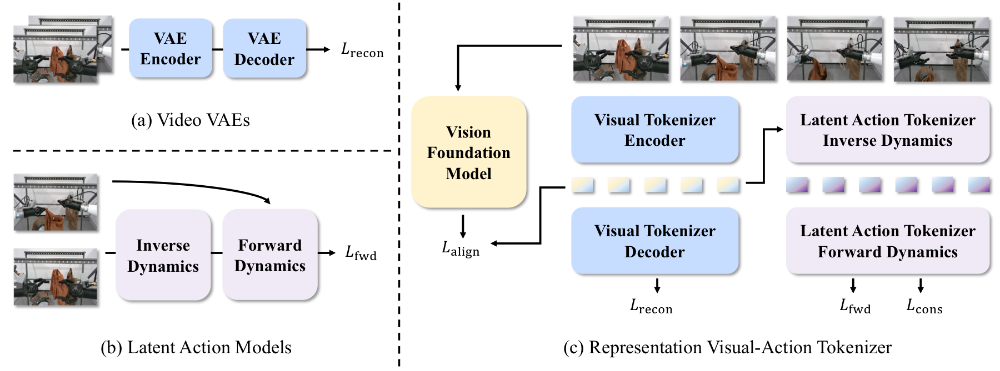
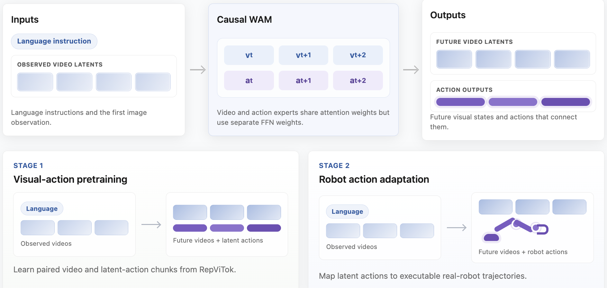
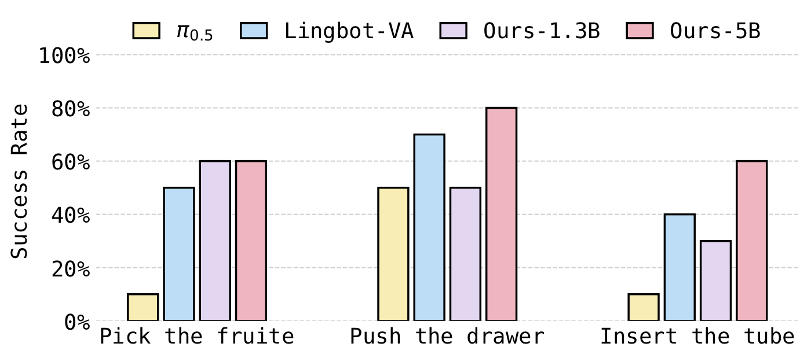
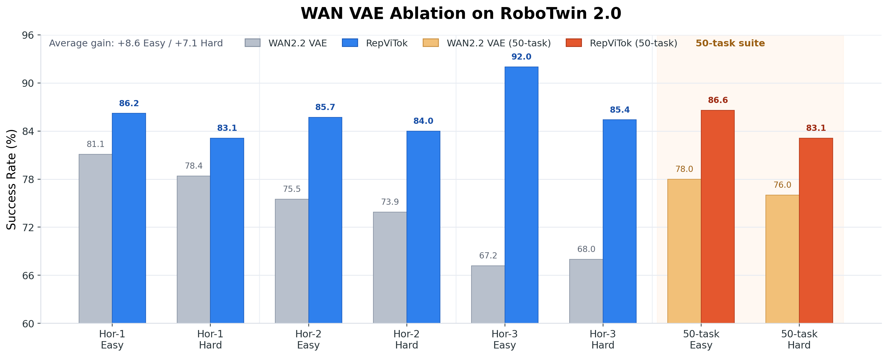
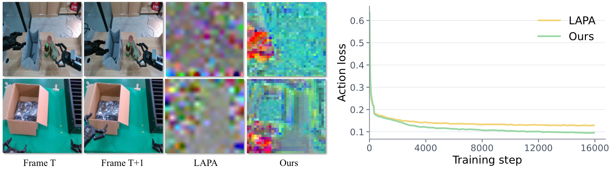

<div align="center">
  <h1>RepWAM: World Action Modeling with<br>Representation Visual-Action Tokenizers</h1>

  <p>
    Junke Wang<sup>1</sup> &nbsp;&nbsp;
    Qihang Zhang<sup>2</sup> &nbsp;&nbsp;
    Shuai Yang<sup>2</sup> &nbsp;&nbsp;
    Yiming Luo<sup>2</sup> &nbsp;&nbsp;
    Yujun Shen<sup>2</sup> &nbsp;&nbsp;
    Zuxuan Wu<sup>1,*</sup> &nbsp;&nbsp;
    Yu-Gang Jiang<sup>1,*</sup> &nbsp;&nbsp;
    Yinghao Xu<sup>2,3,*</sup>
  </p>

  <p>
    <sup>1</sup>Institute of Trustworthy Embodied AI, Fudan University &nbsp;&nbsp;
    <sup>2</sup>Robbyant, Ant Group
    <br>
    <sup>3</sup>Hong Kong University of Science and Technology
    <br>
    <sup>*</sup>Corresponding authors
  </p>

  <p>
    <a href="https://arxiv.org/abs/2606.13674"></a>
    <a href="https://wdrink.github.io/RepWAM/"></a>
    <a href="https://huggingface.co/papers/2606.13674"></a>
    <a href="#citation"></a>
  </p>
</div>

## Introduction

RepWAM is a representation-centric world action model, built around semantic visual-action tokenization. It first learns a visual-action tokenizer, and then trains a causal WAM to model future states and actions under language instructions, enabling effective transfer from world modeling to robot control.

## Highlights

- ⛰️ RepWAM is the first representation-centric WAM trained on semantic visual and action latent tokens.
- ⚡️ Our representation visual-action tokenizer, RepViTok, not only achieves superior visual reconstruction quality, but also transfers well to robot actions.
- 🔥 Leading performance on real robot tasks and RoboTwin 2.0, showing clear gains over WAN2.2 VAE.

## Open-source Plan

- [2026/06/12] ~~Paper release.~~
- [2026/06] Inference code release.
- [2026/06] Code and model weights release.

## Method

### Representation Visual-Action Tokenizer

RepViTok first trains a video tokenizer with both pixel reconstruction and semantic alignment supervision. On top of the visual latent space, it then learns latent actions as compact transitions between visual states.

<p align="center">
  
</p>

### World Action Model

With the paired visual-action latents, RepWAM trains a causal diffusion transformer over visual-action chunks, jointly modeling future visual states and the latent actions that connect them under language conditioning.

<p align="center">
  
</p>

## Results

### Real-world Manipulation

We evaluate our model on a Franka dual-arm robot platform across three manipulation tasks, on which RepWAM consistently surpasses existing vision-language-action models and WAMs.

<p align="center">
  
</p>

<p align="center"><strong>Real-world rollouts</strong></p>

<p align="center">
  <sub><strong>Pick Fruit</strong> &nbsp; | &nbsp; Pick fruits into a plate.</sub><br>
  
</p>

<p align="center">
  <sub><strong>Push Drawer</strong> &nbsp; | &nbsp; Push a drawer and place a block inside.</sub><br>
  
</p>

<p align="center">
  <sub><strong>Insert Tube</strong> &nbsp; | &nbsp; Insert a test tube into a rack.</sub><br>
  
</p>

### RoboTwin 2.0

Trained from scratch without a pretrained video-generation backbone, RepWAM reaches competitive results on RoboTwin 2.0, *i.e.,* 89.3 on Easy and 88.4 on Hard over the 50-task RoboTwin suite.

| Model | Backbone pretrained | Hor-2 Easy | Hor-2 Hard | Hor-3 Easy | Hor-3 Hard | 50-task Easy | 50-task Hard |
|:--|:--:|--:|--:|--:|--:|--:|--:|
| pi0.5 | Yes | 79.3 | 73.0 | 78.6 | 67.4 | 82.7 | 76.8 |
| Motus | Yes | 85.2 | 80.9 | 85.0 | 84.2 | 88.7 | 87.0 |
| Lingbot-VA | Yes | 85.3 | <u>86.9</u> | <u>89.6</u> | **90.6** | **92.9** | **91.6** |
| RepWAM-1.3B | No | <u>85.7</u> | 84.0 | **92.0** | 85.4 | 86.6 | 83.1 |
| RepWAM-5B | No | **87.4** | **87.6** | 88.0 | <u>90.4</u> | <u>89.3</u> | <u>88.4</u> |

Replacing WAN2.2 VAE with RepViTok improves the average success rate by 8.6 points on Easy and 7.1 points on Hard, supporting the importance of semantic visual-action tokenization for world action modeling.

<p align="center">
  
</p>


## Visualizations

### Video Generation

Open-loop video generation results from RepWAM.

<p align="center">
  
</p>

### Latent Actions

Compared with prior latent action models, RepViTok better captures manipulation-relevant changes, thus leading to lower action loss.

<p align="center">
  
</p>

## Citation

If you find RepWAM helpful, please consider 🌟 our repo and citing the paper.

```bibtex
@article{wang2026repwam,
  title  = {RepWAM: World Action Modeling with Representation Visual-Action Tokenizers},
  author = {Wang, Junke and Zhang, Qihang and Yang, Shuai and Luo, Yiming and Shen, Yujun and Wu, Zuxuan and Jiang, Yu-Gang and Xu, Yinghao},
  journal={arXiv preprint arXiv:2606.13674},
  year   = {2026}
}
```
